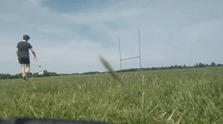
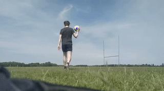

# Gaelic Football Tracking

This repo contains the code for the simple ball tracking tool discussed in my [blog post](https://paulminogue.com/index.php/2020/06/22/using-opencv-scipy-and-scikit-learn-to-develop-a-simple-gaelic-football-tracking-system/). This approach leverages OpenCV, the YOLO model, and scipy's curve fitting functionality to track the trajectory of a ball within a video.

## Example outputs

*Example 1*:



*Example 2*:



## Project structure

Since I have excluded the YOLO model from this repository due to its size, I have outlined the suggested folder structure for this repo below

```
  |-utils
  |  |-trajectory_functions.py
  |  |-yolo.py
  |-yolo
  |  |-coco.names
  |  |-yolov3.cfg
  |  |-yolov3.weights
  |-data
  |  |-output_data
  |  |  |-example_1.mp4
  |  |  |-example_2.mp4
  |  |-input_data
  |  |  |-example_1.mp4
  |  |  |-example_2.mp4
  |-ball_tracking.py
```

## Downloading the YOLO model

To download the weights, simply switch to the YOLO directory and run `wget https://pjreddie.com/media/files/yolov3.weights`. This will download the model weights from the [official site](https://pjreddie.com/darknet/yolo/).

The model architecture can be downloaded from [here](https://github.com/pjreddie/darknet/blob/master/cfg/yolov3.cfg), and the models labels are available [here](https://github.com/pjreddie/darknet/blob/master/data/coco.names)